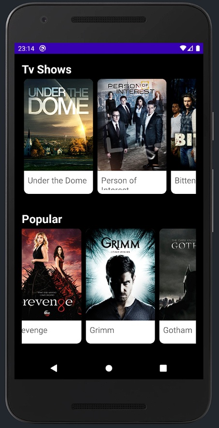

<a name="readme-top"></a>

<!-- PROJECT SHIELDS -->
<!--
*** I'm using markdown "reference style" links for readability.
*** Reference links are enclosed in brackets [ ] instead of parentheses ( ).
*** See the bottom of this document for the declaration of the reference variables
*** for contributors-url, forks-url, etc. This is an optional, concise syntax you may use.
*** https://www.markdownguide.org/basic-syntax/#reference-style-links
-->
[![Contributors][contributors-shield]][contributors-url]
[![Forks][forks-shield]][forks-url]
[![Issues][issues-shield]][issues-url]
[![License][license-shield]][license-url]
[![LinkedIn][linkedin-shield]][linkedin-url]


<!-- PROJECT LOGO -->
<br />
<div align="center">
  <a href="https://github.com/L0pesi/lomamo3">
    
  </a>

  <h3 align="center">Lomamo - Movies for You</h3>

  <p align="center">
    Trabalho Prático de PDM - LESI-IPCA
    <br />
    <br />
    Sérgio Lopes - 8390
    <br />
    José Matos - 19334
    <br />
    Rodolfo Mota - 12746 
    <br />
    <br />
    <a href="https://github.com/L0pesi/lomamo3"><strong>Explore the docs »</strong></a>
    <br />
    <br />
    <a href="https://github.com/L0pesi/lomamo3">View Demo</a>
    ·
    <a href="https://github.com/L0pesi/lomamo3/issues">Report Bug</a>
    ·
    <a href="https://github.com/L0pesi/lomamo3/issues">Request Feature</a>
  </p>
</div>


<!-- TABLE OF CONTENTS -->
<details>
  <summary>Table of Contents</summary>
  <ol>
    <li>
      <a href="#about-the-project">About The Project</a>
      <ul>
        <li><a href="#built-with">Built With</a></li>
      </ul>
    </li>
    <li>
      <a href="#getting-started">Getting Started</a>
      <ul>
        <li><a href="#prerequisites">Prerequisites</a></li>
        <li><a href="#installation">Installation</a></li>
      </ul>
    </li>
    <li><a href="#usage">Usage</a></li>
    <li><a href="#roadmap">Roadmap</a></li>
    <li><a href="#contributing">Contributing</a></li>
    <li><a href="#license">License</a></li>
    <li><a href="#contact">Contact</a></li>
    <li><a href="#acknowledgments">Acknowledgments</a></li>
  </ol>
</details>


<!-- ABOUT THE PROJECT -->
## About The Project

<br />
<div align="center">
  <a href="https://github.com/L0pesi/lomamo3">
    
  </a>
  </div>
  <br />

O Lomamo Movie App é uma Aplicação desenvolvida em Kotlin no Android Studio seguindo um padrão de arquitetura MVVM (Model-View-ViewModel). Quer-se com a esta app navegar pelos filmes e ver detalhes dos mesmo entre outras funcionalidaes.

What our API will do:
* Your time should be focused on creating something amazing. A project that solves a problem and helps others
* You shouldn't be doing the same tasks over and over like creating a README from scratch
* You should implement DRY principles to the rest of your life :smile:


<p align="right">(<a href="#readme-top">back to top</a>)</p>


### Built With

This section should list any major frameworks/libraries used to bootstrap your project. Leave any add-ons/plugins for the acknowledgements section. Here are a few examples.

* Kotlin
* Android Studio

* MVVM
* Dagger-Hilt
* LiveData
* Retrofit2
* Movie Api

<!--
* 
* 
* 
* 
* 
* 
* 
* 
* 
-->

* 
* 

Vamos Usar neste trabalho a Arquitetura MVVM (Model-View-ViewModel). 


https://en.wikipedia.org/wiki/Model%E2%80%93view%E2%80%93viewmodel


<p align="right">(<a href="#readme-top">back to top</a>)</p>


<!-- GETTING STARTED -->
## Getting Started

This are the instructions on setting up the project locally.
To get a local copy up and running follow these simple example steps.


### Prerequisites

Here are the Pre-requisites for the API:
* Free will
  ```sh
  Free Will and clear mind
  ```

### Installation

_Below is an instruct on installing and setting up your app._

1. Clone the repo
   ```sh
   git clone https://github.com/L0pesi/lomamo3.git
   ```
3. Install 
   ```
   install
   ```


<p align="right">(<a href="#readme-top">back to top</a>)</p>


<!-- USAGE EXAMPLES -->
## Usage

Use this space to show useful examples of how a project can be used. Additional screenshots, code examples and demos work well in this space. You may also link to more resources.


[](https://www.youtube.com/watch?v=mGziXLbKAy4&t=2s "Now in Android: 55")


_For more examples, please refer to the [Documentation](https://example.com)_

<p align="right">(<a href="#readme-top">back to top</a>)</p>


<!-- ROADMAP -->
## Roadmap

- [x] Build a README.md
- [ ] Add a documentation API
- [ ] Add "components" document to easily copy & paste sections of the readme
- [ ] Multi-language Support
    - [ ] Portuguese

See the [open issues](https://github.com/L0pesi/lomamo3/issues) for a full list of proposed features (and known issues).

<p align="right">(<a href="#readme-top">back to top</a>)</p>


<!-- CONTRIBUTING -->
## Contributing

Contributions are what make the open source community such an amazing place to learn, inspire, and create. Any contributions you make are **greatly appreciated**.

If you have a suggestion that would make this better, please fork the repo and create a pull request. You can also simply open an issue with the tag "enhancement".
Don't forget to give the project a star! Thanks again!

1. Fork the Project
2. Create your Feature Branch (`git checkout -b feature/AmazingFeature`)
3. Commit your Changes (`git commit -m 'Add some AmazingFeature'`)
4. Push to the Branch (`git push origin feature/AmazingFeature`)
5. Open a Pull Request

<p align="right">(<a href="#readme-top">back to top</a>)</p>


<!-- LICENSE -->
## License

Distributed under the IPCA License. See `LICENSE.txt` for more information.

<p align="right">(<a href="#readme-top">back to top</a>)</p>


<!-- CONTACT -->
## Contact

Our Team
<br />
<br />
[![github][github]][github-sergio]  <b>  Sérgio Lopes  </b>  [![gmail][gmail]][gmail-sergio]
<br />
[![github][github]][github-ze]  <b>  José Matos  </b>  [![gmail][gmail]][gmail-ze]
<br />
[![github][github]][github-rodolfo]  <b>  Rodolfo Mota  </b>  [![gmail][gmail]][gmail-rodolfo]
<br />
<br />


<p align="right">(<a href="#readme-top">back to top</a>)</p>


<!-- ACKNOWLEDGMENTS -->
## Acknowledgments

Use this space to list resources you find helpful and would like to give credit to. I've included a few of my favorites to kick things off!

* [Free Logo Maker - Hatchful](https://www.shopify.com/tools/logo-maker)
* [Markdown Badges](https://ileriayo.github.io/markdown-badges/)
* [Img Shields](https://shields.io)
* [Dall-E 2](https://openai.com/dall-e-2/)


<!--
* [Choose an Open Source License](https://choosealicense.com)
* [GitHub Emoji Cheat Sheet](https://www.webpagefx.com/tools/emoji-cheat-sheet)
* [Malven's Flexbox Cheatsheet](https://flexbox.malven.co/)
* [Malven's Grid Cheatsheet](https://grid.malven.co/)
* [Img Shields](https://shields.io)
* [GitHub Pages](https://pages.github.com)
* [Font Awesome](https://fontawesome.com)
* [React Icons](https://react-icons.github.io/react-icons/search)
-->

<p align="right">(<a href="#readme-top">back to top</a>)</p>


<!-- MARKDOWN LINKS & IMAGES -->
<!-- https://www.markdownguide.org/basic-syntax/#reference-style-links -->
[contributors-shield]: https://img.shields.io/github/contributors/L0pesi/L4U?style=for-the-badge
[contributors-url]: https://github.com/L0pesi/lomamo3/graphs/contributors
[github]: https://img.shields.io/badge/github-%23121011.svg?style=flat&logo=github&logoColor=white
[github-sergio]: https://github.com/L0pesi/
[github-diogo]: https://github.com/jose-artur90/
[github-yuno]: https://github.com/RodolfoMota/
[gmail]: https://img.shields.io/badge/Gmail-D14836?style=plastic&logo=gmail&logoColor=white
[gmail-sergio]: sergiomaciel21@gmail.com
[gmail-diogo]: jose.artur.matos90@gmail.com
[gmail-yuno]: rmota@egapi.com
[forks-shield]: https://img.shields.io/github/languages/code-size/L0pesi/LomamoMovieApp?style=for-the-badge
[forks-url]: https://github.com/L0pesi/lomamo3/
[stars-shield]: https://img.shields.io/github/stars/othneildrew/Best-README-Template.svg?style=for-the-badge
[stars-url]: https://github.com/L0pesi/lomamo3/stargazers
[issues-shield]: https://img.shields.io/github/issues/L0pesi/LomamoMovieApp?style=for-the-badge
[issues-url]: https://github.com/L0pesi/lomamo3/issues
[license-shield]: https://img.shields.io/badge/License-IPCA-brightgreen?style=for-the-badge
[license-url]: https://github.com/L0pesi/lomamo3/blob/master/LICENSE.txt
[linkedin-shield]: https://img.shields.io/badge/-LinkedIn-black.svg?style=for-the-badge&logo=linkedin&colorB=555
[linkedin-url]: https://linkedin.com/in/lomamo3
[product-screenshot]: images/screenshot.png
[Next.js]: https://img.shields.io/badge/next.js-000000?style=for-the-badge&logo=nextdotjs&logoColor=white
[Next-url]: https://nextjs.org/
[React.js]: https://img.shields.io/badge/React-20232A?style=for-the-badge&logo=react&logoColor=61DAFB
[React-url]: https://reactjs.org/
[Vue.js]: https://img.shields.io/badge/Vue.js-35495E?style=for-the-badge&logo=vuedotjs&logoColor=4FC08D
[Vue-url]: https://vuejs.org/
[Angular.io]: https://img.shields.io/badge/Angular-DD0031?style=for-the-badge&logo=angular&logoColor=white
[Angular-url]: https://angular.io/
[Svelte.dev]: https://img.shields.io/badge/Svelte-4A4A55?style=for-the-badge&logo=svelte&logoColor=FF3E00
[Svelte-url]: https://svelte.dev/
[Laravel.com]: https://img.shields.io/badge/Laravel-FF2D20?style=for-the-badge&logo=laravel&logoColor=white
[Laravel-url]: https://laravel.com
[Bootstrap.com]: https://img.shields.io/badge/Bootstrap-563D7C?style=for-the-badge&logo=bootstrap&logoColor=white
[Bootstrap-url]: https://getbootstrap.com
[JQuery.com]: https://img.shields.io/badge/jQuery-0769AD?style=for-the-badge&logo=jquery&logoColor=white
[JQuery-url]: https://jquery.com 
